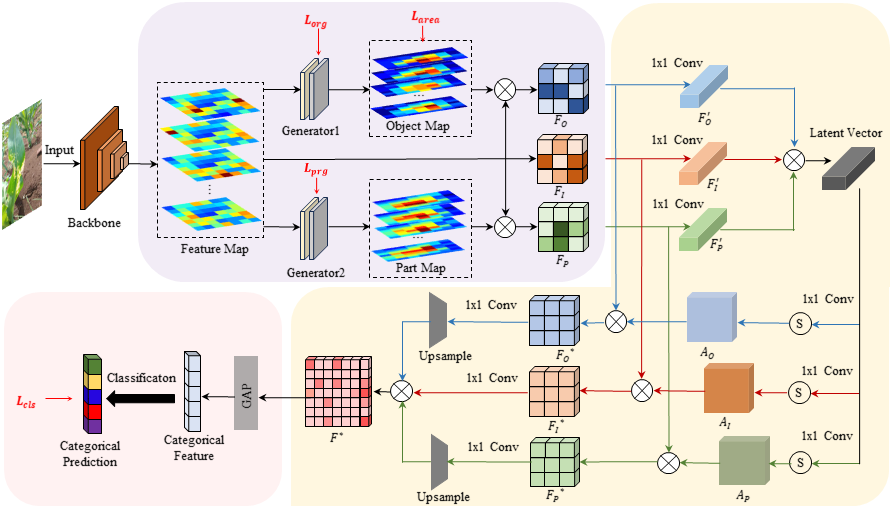

# PFMNet

This is a PyTorch implementation of the paper "Progressive feature learning and multiplicative feature fusion network for corn disease recognition"(https://doi.org/10.21203/rs.3.rs-5711522/v1).

CornD sample download:
https://pan.baidu.com/s/13EnFlk87wwcpyCexirV5Jg?pwd=1234
